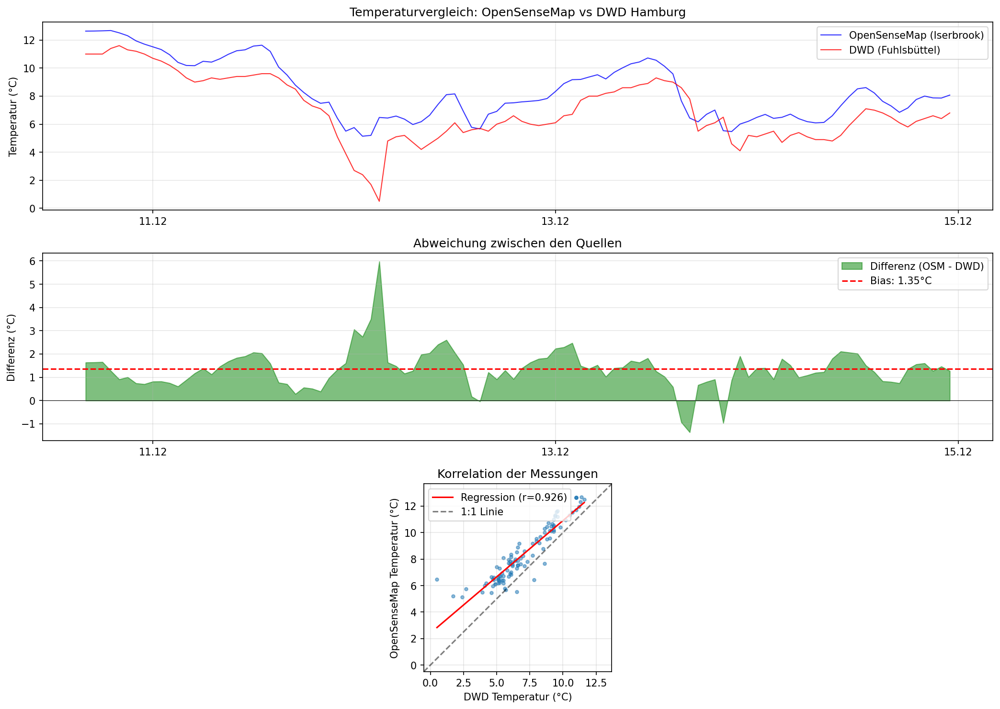

# Temperaturvergleich: OpenSenseMap vs DWD Hamburg

## 1. Übersicht

**Ziel:** Vergleich der Temperaturdaten zweier unabhängiger Quellen in Hamburg

| Parameter | Wert |
|-----------|------|
| **Zeitraum** | 10.12.2025 - 14.12.2025 |
| **Sampling** | 1 Stunde (Mittelwert) |
| **Variable** | Lufttemperatur (°C) |
| **Anzahl Messpaare** | 104 |

---

## 2. Datenquellen

### Quelle A: OpenSenseMap (Citizen Science)
- **Station:** Hamburg Iserbrook-Ost
- **ID:** 67937b67c326f20007ef99ca
- **Koordinaten:** 53.5812°N, 9.8308°E
- **Typ:** Bürger-Wetterstation (SenseBox)

### Quelle B: DWD (Deutscher Wetterdienst)
- **Station:** Hamburg-Fuhlsbüttel
- **ID:** 01975
- **Koordinaten:** 53.6332°N, 9.9881°E
- **Typ:** Offizielle Klimastation

**Entfernung zwischen Stationen:** ca. 8 km

---

## 3. Datenverarbeitung

### 3.1 Format (vereinheitlicht)
| Feld | Beschreibung |
|------|--------------|
| timestamp_utc | ISO 8601 (UTC) |
| source | opensensemap / dwd |
| station_id | eindeutige Kennung |
| lat, lon | Koordinaten |
| value | Temperatur |
| unit | °C |

### 3.2 Resampling
- Methode: Stundenmittelwert
- Fehlende Werte: Nicht interpoliert

---

## 4. Speicherung in FROST & TIG

### FROST (SensorThings API)
```
Thing = Station (OpenSenseMap / DWD)
  └── Location = lat/lon
  └── Datastream = Temperatur
        └── Observation = (Zeit, Wert)
```

### TIG (InfluxDB)
```
measurement: microclimate
tags: source, station_id
field: temperature
time: timestamp_utc
```

---

## 5. Vergleichsergebnisse

### 5.1 Deskriptive Statistik
| Metrik | OpenSenseMap | DWD |
|--------|--------------|-----|
| Mittelwert | 8.39 °C | 7.04 °C |

### 5.2 Abweichungsmetriken

| Metrik | Wert | Interpretation |
|--------|------|----------------|
| **MAE** (Mittlere absolute Abweichung) | **1.42 °C** | Durchschnittlicher Fehler |
| **Bias** (Systematische Abweichung) | **1.35 °C** | OSM wärmer als DWD |
| **RMSE** (Root Mean Square Error) | **1.60 °C** | Streuung inkl. Ausreißer |
| **Korrelation (r)** | **0.926** | Hoch |
| Max. Abweichung | 5.98 °C | Größter Einzelfehler |
| Standardabweichung | 0.86 °C | Streuung der Differenz |

---

## 6. Interpretation

### 6.1 Gibt es Abweichungen?
**Ja**, die mittlere absolute Abweichung beträgt 1.42 °C.

### 6.2 Sind sie signifikant?
**Nein** — Die Abweichung liegt im Rahmen der typischen Sensorgenauigkeit (±0,5–1,5 °C) und Mikroklimaeffekte.

### 6.3 Mögliche Ursachen
1. **Standortunterschiede:** ~8 km Entfernung, unterschiedliche Stadtteile
2. **Urban Heat Island:** Iserbrook (Wohngebiet) vs. Fuhlsbüttel (Flughafen, offener)
3. **Sensorhöhe & Aufstellung:** Citizen-Science vs. professionelle Messstation
4. **Kalibrierung:** DWD-Sensoren regelmäßig kalibriert
5. **Aggregation:** Unterschiedliche Messintervalle (OpenSenseMap ~5 min, DWD stündlich)

---

## 7. Visualisierung



**Grafik 1:** Zeitreihenvergleich beider Quellen
**Grafik 2:** Differenz (OSM - DWD) mit Bias-Linie
**Grafik 3:** Korrelation mit Regressionsgerade

---

## 8. Fazit

> **Die Temperaturmessungen von OpenSenseMap (Iserbrook) und DWD Hamburg (Fuhlsbüttel) zeigen eine hohe zeitliche Korrelation (r = 0.926) bei einer mittleren Abweichung von ca. 1.4 °C (Bias: +1.35 °C). Dies liegt im Rahmen typischer Sensor- und Mikroklimaeffekte für urbane Messstandorte mit ~8 km Entfernung.**

---

## Anhang: Technische Details

- **FROST Server:** http://localhost:8091/FROST-Server/v1.1
- **Datenformat:** SensorThings API (OGC Standard)
- **Analysezeitraum:** 2025-12-10 bis 2025-12-14
- **Python-Bibliotheken:** pandas, numpy, matplotlib, requests
