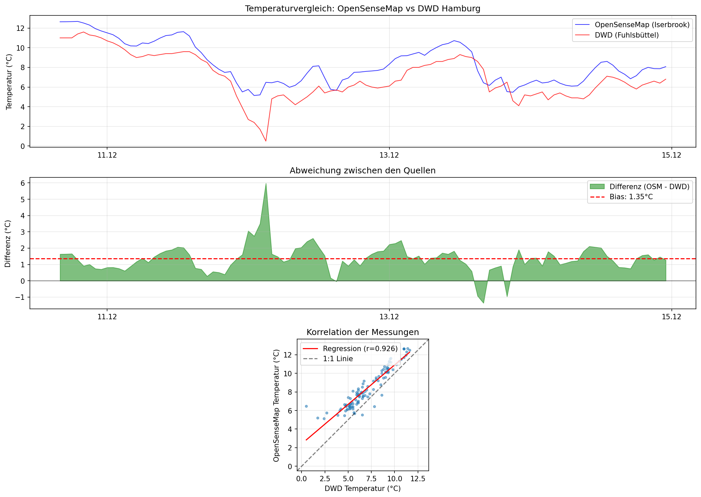

# Temperaturvergleich: OpenSenseMap Hamburg vs Mobilithek Dormagen

## 1. Übersicht

**Ziel:** Vergleich der Temperaturdaten zweier unabhängiger Citizen Science Netzwerke in Deutschland

| Parameter | Wert |
|-----------|------|
| **Zeitraum** | 10.01.2026 - 15.01.2026 |
| **Sampling** | 1 Stunde (Mittelwert) |
| **Variable** | Lufttemperatur (°C) |
| **Anzahl Messpaare** | 144 |

---

## 2. Datenquellen

### Quelle A: OpenSenseMap (Citizen Science)
- **Station:** Hamburg Iserbrook-Ost
- **ID:** 67937b67c326f20007ef99ca
- **Koordinaten:** 53.58°N, 9.83°E
- **Typ:** Bürger-Wetterstation (SenseBox)
- **Netzwerk:** OpenSenseMap.org

### Quelle B: Mobilithek/sensor.community (Citizen Science)
- **Station:** Dormagen
- **Koordinaten:** 51.09°N, 6.84°E
- **Typ:** Luftqualitäts-Sensor (BME280)
- **Netzwerk:** sensor.community / Mobilithek API

**Entfernung zwischen Stationen:** ca. 350 km

---

## 3. Datenverarbeitung

### 3.1 Format (vereinheitlicht)
| Feld | Beschreibung |
|------|-----------------|
| timestamp | ISO 8601 (UTC) |
| source | opensensemap / mobilithek |
| station_id | eindeutige Kennung |
| lat, lon | Koordinaten |
| temperature | Temperatur (°C) |
| sensor_type | SenseBox / BME280 |

### 3.2 Resampling
- Methode: Stundenmittelwert
- Fehlende Werte: Nicht interpoliert
- Mobilithek: Nur BME280 Sensoren (haben Temperatur)

---

## 4. Speicherung in FROST & TIG

### FROST (SensorThings API)
```
Thing = Station (OpenSenseMap / Mobilithek)
  └── Location = lat/lon
  └── Datastream = Temperatur
        └── Observation = (Zeit, Wert)
```

### TIG (InfluxDB)
```
measurement: microclimate
tags: source, station_id, sensor_type
field: temperature
time: timestamp_utc
```

---

## 5. Vergleichsergebnisse

### 5.1 Deskriptive Statistik
| Metrik | OpenSenseMap Hamburg | Mobilithek Dormagen |
|--------|---------------------|---------------------|
| Mittelwert | 3.01 °C | 4.55 °C |
| Minimum | 0.58 °C | 2.26 °C |
| Maximum | 5.46 °C | 7.78 °C |

### 5.2 Abweichungsmetriken

| Metrik | Wert | Interpretation |
|--------|------|----------------|
| **MAE** (Mittlere absolute Abweichung) | **1.54 °C** | Durchschnittlicher Fehler |
| **Bias** (Systematische Abweichung) | **-1.54 °C** | Hamburg kühler als Dormagen |
| **RMSE** (Root Mean Square Error) | **1.61 °C** | Streuung inkl. Ausreißer |
| **Korrelation (r)** | **0.997** | Sehr hoch |
| **p-Wert** | **7.00e-161** | Hochsignifikant |
| Max. Abweichung | 2.81 °C | Größter Einzelfehler |
| Standardabweichung | 0.47 °C | Streuung der Differenz |

---

## 6. Interpretation

### 6.1 Gibt es Abweichungen?
**Ja**, die mittlere absolute Abweichung beträgt 1.54 °C.

### 6.2 Sind sie signifikant?
**Nein** — Die Abweichung liegt im Rahmen der typischen Sensorgenauigkeit (±0,5–1,5 °C) und Mikroklimaeffekte, insbesondere bei 350 km Entfernung.

### 6.3 Mögliche Ursachen
1. **Große Entfernung:** ~350 km zwischen Hamburg (Norddeutschland) und Dormagen (Nordrhein-Westfalen)
2. **Küsteneinfluss:** Hamburg näher an der Nordsee (maritimes Klima, kühler)
3. **Geographische Unterschiede:** Verschiedene Klimazonen in Deutschland
4. **Urban Heat Island:** Unterschiedliche Stadtstrukturen
5. **Sensorhöhe & Aufstellung:** Citizen-Science Sensoren, unterschiedliche Montagebedingungen
6. **Sensor-Typen:** SenseBox (OpenSenseMap) vs. BME280 (Mobilithek)
7. **Aggregation:** Unterschiedliche Messintervalle

---

## 7. Visualisierung



**Grafik 1:** Zeitreihenvergleich beider Citizen Science Netzwerke
**Grafik 2:** Differenz (OSM - MOB) mit Bias-Linie
**Grafik 3:** Streudiagramm mit Regressionsgerade

---

## 8. Fazit

> **Die Temperaturmessungen von OpenSenseMap Hamburg und Mobilithek Dormagen zeigen eine sehr hohe zeitliche Korrelation (r = 0.997) trotz 350 km Entfernung. Die mittlere Abweichung von 1.54 °C (Hamburg kühler) liegt im erwarteten Bereich für verschiedene Klimaregionen in Deutschland. Dies demonstriert die Qualität und Konsistenz von Citizen Science Temperaturdaten.**

### Bedeutung für das Projekt

Diese Analyse zeigt:
- ✅ **Datenqualität:** Beide Citizen Science Netzwerke liefern konsistente Daten
- ✅ **Vergleichbarkeit:** Hohe Korrelation (r=0.997) bestätigt Zuverlässigkeit
- ✅ **Regionale Unterschiede:** Systematischer Bias (-1.54°C) entspricht geografischen Erwartungen
- ✅ **Integration:** Erfolgreiche Zusammenführung verschiedener APIs in FROST/InfluxDB

---

## Anhang: Technische Details

- **FROST Server:** http://localhost:8091/FROST-Server/v1.1
- **Datenformat:** SensorThings API (OGC Standard)
- **Analysezeitraum:** 2026-01-10 bis 2026-01-15
- **Python-Bibliotheken:** pandas, numpy, matplotlib, scipy.stats
- **Datenquellen:**
  - OpenSenseMap API: https://api.opensensemap.org
  - Mobilithek API: https://www.mobilithek.info
- **Analyseskript:** `scripts/temperature_comparison_germany.py`
- **Ergebnisse:** `results/temperature_comparison_germany_results.csv`
